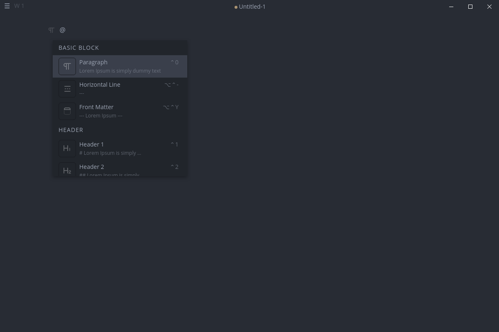
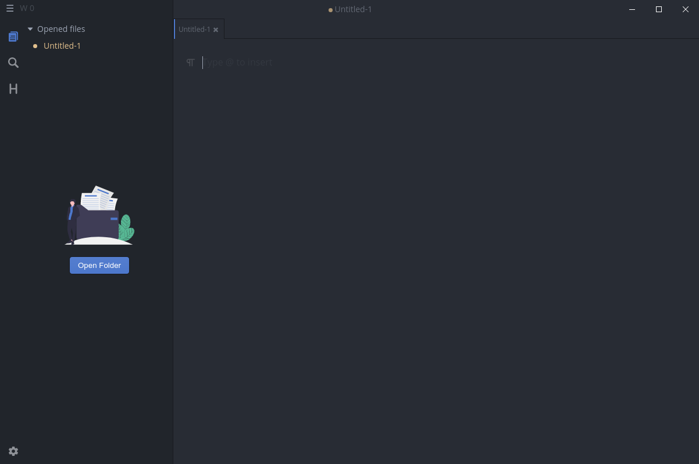
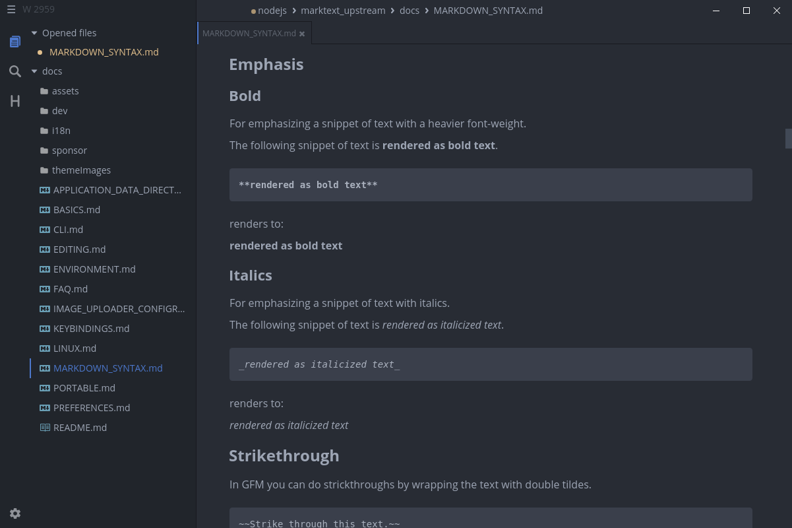
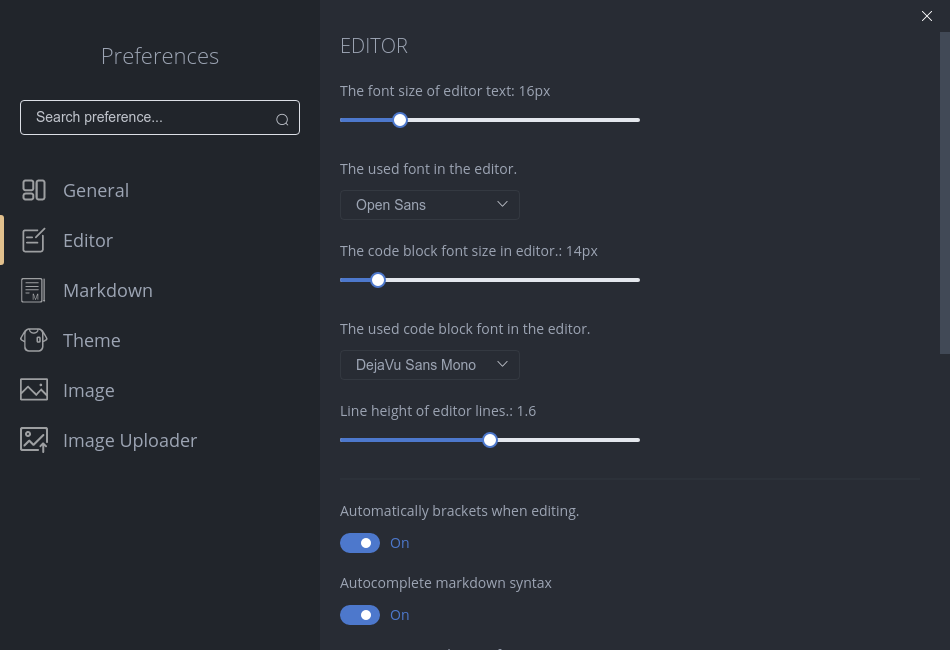

# 基础使用（Basics）

## 1. 开始使用

MarkText 是一款支持多种 Markdown 扩展的实时预览（所见即所得）编辑器。你可以像普通编辑器一样直接输入和修改文本，MarkText 会尽量隐藏不必要的语法噪音，让写作更专注

首次启动 MarkText 时，会打开一个空的编辑器窗口。你可以通过以下方式快速熟悉可用功能：

- 查看 [快捷键总览](KEYBINDINGS.md)
- 打开命令面板（Command Palette）：<kbd>CmdOrCtrl</kbd>+<kbd>Shift</kbd>+<kbd>P</kbd>
- 在编辑区输入 `@`：呼出可用文本元素/块的快捷入口

MarkText 的界面尽量保持简洁，下面会从界面与常用操作开始介绍

### 1.1 界面

#### 1.1.1 显示/隐藏侧边栏

侧边栏由三个面板组成，你可以通过 <kbd>CmdOrCtrl</kbd>+<kbd>J</kbd> 显示/隐藏侧边栏：

- 已打开目录的文件树（目录浏览）
- 全局搜索（Find in files）
- 当前标签页的目录（TOC）

#### 1.1.2 显示/隐藏标签栏

MarkText 可以像单文件编辑器一样使用，但每个文件会在单独的标签页中打开。你可以通过 <kbd>CmdOrCtrl</kbd>+<kbd>Alt</kbd>+<kbd>B</kbd> 显示/隐藏标签栏，并通过拖拽改变标签顺序

**想在隐藏标签栏的情况下使用多标签？**

你可以隐藏标签栏，然后使用快捷键（例如 <kbd>CmdOrCtrl</kbd>+<kbd>Tab</kbd>）在标签间切换，或通过侧边栏的 *opened files*（已打开文件）列表切换

#### 1.1.3 切换编辑模式

你可以使用 <kbd>CmdOrCtrl</kbd>+<kbd>Alt</kbd>+<kbd>S</kbd> 在“实时预览编辑器”和“源码模式编辑器”之间切换。实时预览编辑器是默认模式，功能更完整。更详细的功能说明见：[深入编辑功能](EDITING.md)

#### 1.1.4 打字机模式与专注模式

使用 <kbd>CmdOrCtrl</kbd>+<kbd>Shift</kbd>+<kbd>F</kbd> 进入“专注模式”（减少干扰），或使用 <kbd>CmdOrCtrl</kbd>+<kbd>Alt</kbd>+<kbd>T</kbd> 进入“打字机模式”

## 2. 打开与编辑 Markdown 文件

### 2.1 打开你的第一个文件

你可以使用菜单 `File -> Open File`，或按 <kbd>CmdOrCtrl</kbd>+<kbd>O</kbd> 打开文件选择对话框来选择一个 Markdown 文件

另外，你也可以通过命令行启动 MarkText 并传入文件或目录（详见 [命令行（CLI）](CLI.md)）

### 2.2 保存修改

编辑后可以使用 <kbd>CmdOrCtrl</kbd>+<kbd>S</kbd> 保存文件；如果需要另存为不同文件名，请使用 *Save As*（另存为）

### 2.3 打开一个目录

MarkText 也支持打开一个目录：使用 <kbd>CmdOrCtrl</kbd>+<kbd>Shift</kbd>+<kbd>O</kbd>，或点击侧边栏按钮 *Open Folder*

打开目录后，侧边栏会显示该根目录下的文件树。你可以在树状视图里继续打开文件、浏览并编辑目录中的内容。文件树上方通常会展示已打开的文件列表

你还可以使用“快速打开”（Quick Open）：<kbd>CmdOrCtrl</kbd>+<kbd>P</kbd>，从当前打开的根目录中快速检索并打开文件，并可用方向键选择、回车确认，或用鼠标点选

要切换到侧边栏的其他面板（例如全局搜索），点击侧边栏左侧的图标即可

## 3. 主题

你可以在应用菜单的 Themes/主题 相关条目中切换应用主题

## 4. 偏好设置

你可以在设置窗口中修改所有偏好设置，也可以直接编辑 [应用数据目录](APPLICATION_DATA_DIRECTORY.md) 中的 `preferences.json`。关于偏好设置文件的详细字段说明见：[偏好设置](PREFERENCES.md)

- 通用应用设置
- 编辑器外观相关设置
- Markdown 相关设置
- 应用主题
- 图片处理方式相关选项

