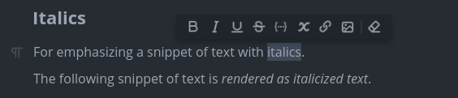
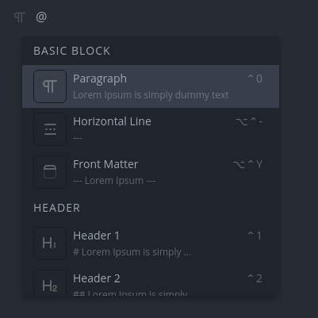
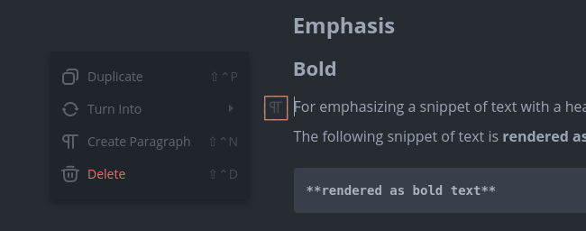
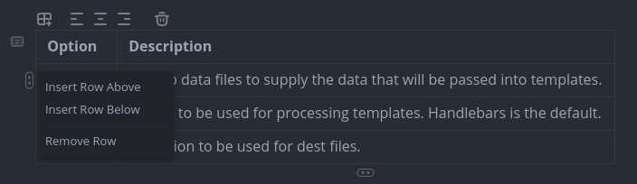
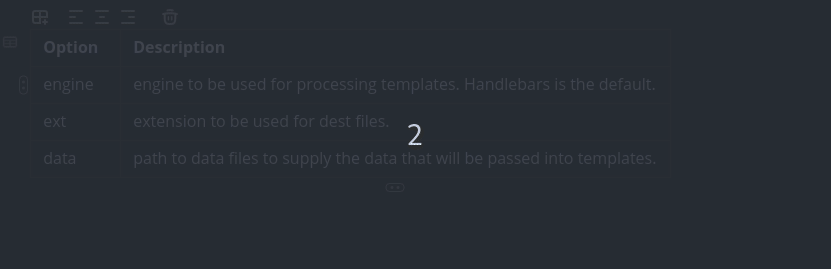
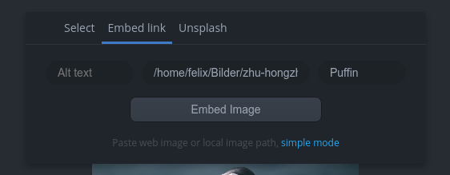
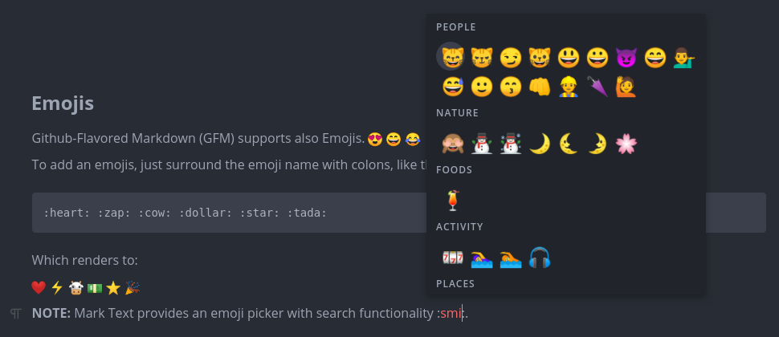
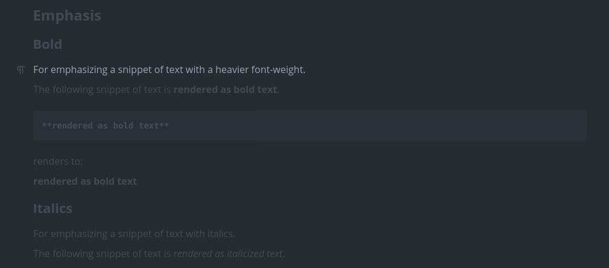

# 深入编辑功能

本篇介绍实时预览编辑器的常用编辑能力与一些“提高效率”的工具

## 1. 文本编辑与格式化

MarkText 会实时展示排版后的效果，你既可以像普通编辑器那样直接输入，也可以使用 Markdown 语法
为了提升效率，MarkText 提供了大量快捷键来辅助文本操作；同时你也可以在偏好设置中调整编辑器相关选项，例如字体、自动补全、行宽等

## 2. 选择（Selections）

你可以用鼠标拖拽选择文本、双击选择单词，或使用键盘 <kbd>Shift</kbd> + <kbd>方向键</kbd> 进行选择

**格式浮层（Format overlay）：**

当你选中文本时，会自动弹出一个“格式浮层”。你可以在这里快速对选中文本应用/移除常见的内联格式

- 加粗
- 斜体
- 下划线
- 删除线
- 行内代码
- 行内数学公式
- 创建链接
- 创建图片
- 移除格式

此外，还有针对 Emoji、链接、图片、表格等场景的浮层/工具

## 3. 删除结构块

要删除标题、列表或表格等结构块时，通常只需要选中对应区域并按退格键（Backspace）

## 4. 括号与引号自动补全

你可以在偏好设置中配置 MarkText 自动补全 Markdown 语法、括号与引号。默认情况下，当你输入第一个字符时，会自动补全：`()`、`[]`、`{}`、`**`、`__`、`$$`、`""`、`''`

## 5. 链接

默认情况下链接会以“普通文本样式”展示；当你点击链接时，会显示为带标题与 URL 的 Markdown 链接形式，类似下图：

## 6. 自动格式化

MarkText 会尽量按照 CommonMark 与 GitHub Flavored Markdown（GFM）规范自动格式化你的 Markdown 文档。你可以在偏好设置中调整部分格式化相关选项，例如列表缩进规则

## 7. 常用编辑功能

### 7.1 快速插入（Quick insert）

当你新起一行时，输入 `@` 会弹出一个菜单，列出可用的 Markdown 元素/块。选择某个条目后，当前行会被转换为对应的元素类型

### 7.2 行转换器（Line transformer）

你可以点击下图高亮的图标，然后选择 `Turn Into`（转换为）将当前行转换成另一种类型
此外，你还可以复制当前行、在当前行上方插入段落，或删除当前行

### 7.3 表格工具（Table tools）

在纯 Markdown 里维护表格往往比较费力。MarkText 提供了表格对话框：按 <kbd>CmdOrCtrl</kbd>+<kbd>Shift</kbd>+<kbd>T</kbd> 可以插入表格并选择行列数
插入后，仍可以通过表格工具（表格上方的工具栏入口）调整行列数量、设置对齐方式等；单元格内也支持常见的行内样式

**插入/删除行与列：**

点击某个单元格后，你可以通过单元格旁的菜单插入/删除行或列：

- 行操作通常位于右侧菜单
- 列操作通常位于底部菜单

**移动表格行/列：**

你可以像下图这样，通过单元格菜单拖拽来移动整行或整列：

### 7.4 图片工具（Image tools）

MarkText 提供图片查看器与图片选择/标注浮层。你可以用鼠标直接拖拽调整图片尺寸，效果会实时生效

点击图片或输入 `` 时，会自动弹出选择框，你可以从磁盘选择图片，也可以粘贴路径或 URL
图片还支持按设置进行自动上传、移动到相对/绝对路径、以及处理“剪贴板粘贴但磁盘上没有文件”的图片（程序会在后台保存/管理这些图片）
此外，你可以设置图片对齐方式：行内、居左、居中或居右

### 7.5 Emoji 选择器（Emoji picker）

无需长时间搜索即可插入 Emoji。在你输入时，候选列表会自动刷新

### 7.6 专注模式（Focus mode）

专注模式会淡化其他行，帮助你聚焦当前行。按 <kbd>CmdOrCtrl</kbd>+<kbd>Shift</kbd>+<kbd>F</kbd> 即可开启

### 7.7 打字机模式（Typewriter mode）

在打字机模式下，光标会尽量保持在编辑器中间位置，减少视线移动

## 8. 文件编码

打开文件时，MarkText 会尝试自动检测文件编码与 BOM（byte-order mark）。默认编码为 UTF-8（通常足够覆盖绝大多数使用场景），也可以在设置里修改默认行为

如果你关闭自动编码检测，则会默认按 UTF-8 处理

当前文件的编码可以通过命令面板（Command Palette）查看，也可以在命令面板里切换

## 9. 行尾（Line endings）

MarkText 会分析每个文件使用的行尾（LF/CRLF），并支持通过命令面板查看与切换

## 10. 查找与替换

**在当前文档内：**

按 <kbd>CmdOrCtrl</kbd>+<kbd>F</kbd> 打开查找框，可以查找文本或进行替换

**在已打开目录中搜索：**

MarkText 内置了文件树（目录浏览）与“在文件中查找”。在搜索栏输入关键字，并按需选择正则、忽略大小写等选项，即可在当前打开的根目录下的 Markdown 文件中进行搜索
