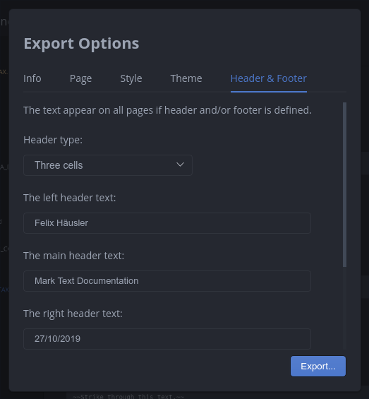
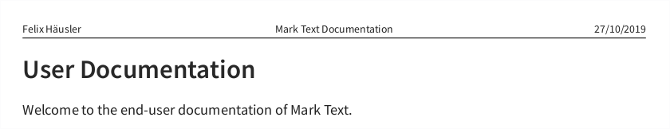

# 导出文档

MarkText 支持把 Markdown 文档导出为 **PDF**、**HTML**，也可以直接 **打印**

导出时会弹出“导出选项（Export Options）”窗口，你可以在导出前调整页面、样式、主题等参数

## 导出选项

### 页面（Page）

- **HTML 导出**：可以设置页面标题（Title）
- **PDF/打印**：可以设置页边距（单位 mm）
- **仅 PDF**：可以设置纸张大小、方向（横向/纵向），并支持自定义宽高（单位 mm）

### 样式（Style）

在不修改主题的前提下，调整导出样式：

- 覆盖字体：字体族、字号、行高
- 标题自动编号（Auto numbering headings）
- 是否显示 Front Matter（例如 YAML front matter）

### 主题（Theme）

导出时可以选择页面主题；导出主题相关说明见：

- [导出主题](EXPORT_THEMES.md)

### 页眉与页脚（Header & Footer）

页眉/页脚选项**仅对 PDF 与打印生效**（HTML 导出不提供该页签）

- 支持三种布局：无 / 单栏 / 三栏（左-中-右）
- 启用后会在每一页重复显示
- 页眉文本支持多行；页脚目前按单行布局展示更稳定
- 可以自定义样式（例如页眉页脚字号、是否允许样式化）

说明：当前实现不提供“自动页码”占位符（例如“第 X 页 / 共 Y 页”）

### 目录（Table of Contents）

可以在导出内容中插入目录（TOC）：

- 设置目录标题（Title）
- 选择是否包含最顶层标题（Include top heading）
