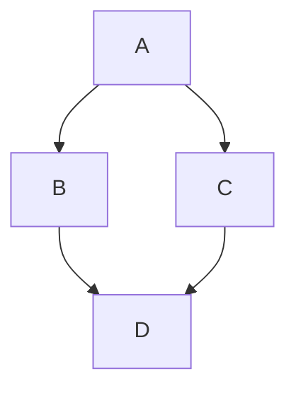
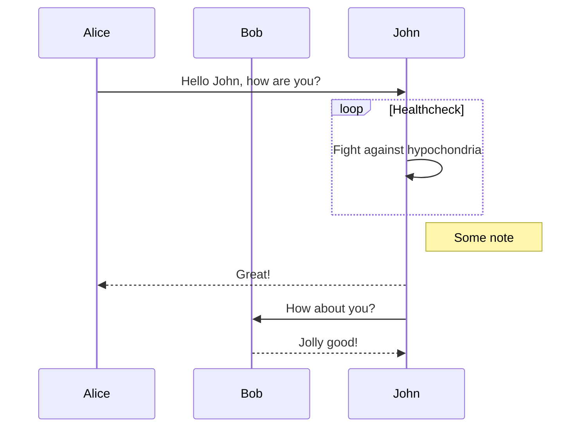
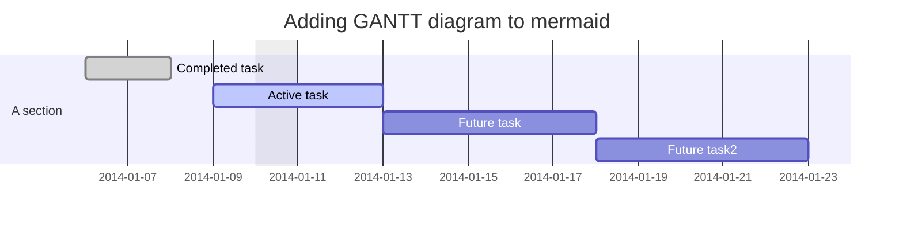
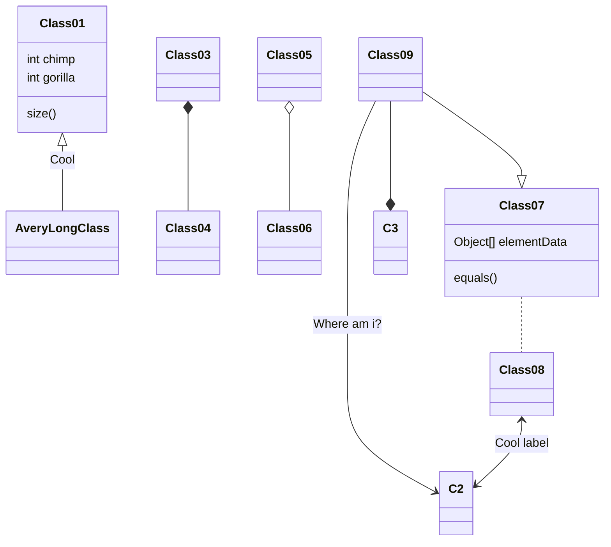
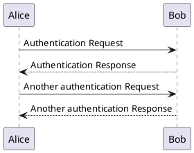

# Markdown 语法

Markdown 是一种易于使用的轻量级标记语言

本文整理了 MarkText 支持的 Markdown 语法与常见扩展，并附带示例

<br>

## 1. 目录

- [Markdown 语法](#markdown-语法)
  - [1. 目录](#1-目录)
  - [2. 标题](#2-标题)
  - [3. 段落](#3-段落)
  - [4. 换行/空行](#4-换行空行)
  - [5. 分隔线](#5-分隔线)
  - [6. 强调](#6-强调)
    - [6.1 加粗](#61-加粗)
    - [6.2 斜体](#62-斜体)
  - [7. 删除线](#7-删除线)
  - [8. 链接](#8-链接)
    - [8.1 自动链接](#81-自动链接)
    - [8.2 行内链接](#82-行内链接)
    - [8.3 链接标题](#83-链接标题)
    - [8.4 命名锚点](#84-命名锚点)
  - [9. 图片](#9-图片)
  - [10. 引用](#10-引用)
  - [11. 列表](#11-列表)
    - [11.1 无序列表](#111-无序列表)
    - [11.2 有序列表](#112-有序列表)
    - [11.3 提升效率的小技巧](#113-提升效率的小技巧)
  - [12. 待办清单](#12-待办清单)
  - [13. 表格](#13-表格)
    - [13.1 单元格对齐](#131-单元格对齐)
  - [14. 代码](#14-代码)
    - [14.1 行内代码](#141-行内代码)
    - [14.2 围栏代码块](#142-围栏代码块)
    - [14.3 缩进代码](#143-缩进代码)
    - [14.4 语法高亮](#144-语法高亮)
  - [15. 键盘按键](#15-键盘按键)
  - [16. 表情（Emoji）](#16-表情emoji)
  - [17. 脚注](#17-脚注)
  - [18. 上标与下标](#18-上标与下标)
  - [19. 元信息（Front Matter）](#19-元信息front-matter)
    - [19.1 YAML](#191-yaml)
    - [19.2 TOML](#192-toml)
    - [19.3 JSON](#193-json)
  - [20. 数学公式](#20-数学公式)
    - [20.1 行内数学公式](#201-行内数学公式)
    - [20.2 块级数学公式](#202-块级数学公式)
  - [21. 图表](#21-图表)
  - [22. PlantUML（UML 图）](#22-plantumluml-图)
  - [23. 原始 HTML](#23-原始-html)
  - [24. 反斜杠转义](#24-反斜杠转义)
  - [25. 鸣谢](#25-鸣谢)

<br>

## 2. 标题

（标题）

```markdown
从 `h1` 到 `h6` 的标题使用不同数量的 `#` 表示级别：
# H1
## H2
### H3
#### H4
##### H5
###### H6

或者使用下划线:

H1
======

H2
------
```

渲染效果：

# h1 Heading <!-- omit in toc -->
## h2 Heading <!-- omit in toc -->
### h3 Heading <!-- omit in toc -->
#### h4 Heading <!-- omit in toc -->
##### h5 Heading <!-- omit in toc -->
###### h6 Heading <!-- omit in toc -->

下划线形式示例：

H1 <!-- omit in toc -->
======

H2 <!-- omit in toc -->
------

<br>

## 3. 段落

（段落）

```markdown
直接书写普通文本即可：
Lorem ipsum dolor sit amet, graecis denique ei vel, at duo primis mandamus. Et legere ocurreret pri, animal tacimates complectitur ad cum. Cu eum inermis inimicus efficiendi. Labore officiis his ex, soluta officiis concludaturque ei qui, vide sensibus vim ad.
```

<br>

## 4. 换行/空行

（换行/空行）

你可以使用多个连续的换行符（`\n`）来在章节之间制造额外空行。但如果需要确保额外的空行不被折叠，可以使用任意数量的 HTML `<br>`

另外，在一行末尾添加 **两个空格** 也可以强制产生软换行

<br>

## 5. 分隔线

（分隔线）

HTML 的 `<hr>` 用于创建段落级别的“主题分隔”。在 Markdown 中，可以使用以下写法：

* `___`：连续三个下划线
* `---`：连续三个短横线
* `***`：连续三个星号

渲染效果：

___

---

***

<br>

## 6. 强调

（强调）

### 6.1 加粗

（加粗）用于强调文本

下面的片段会 **以粗体渲染**：

```markdown
**rendered as bold text**
```

渲染效果：

**rendered as bold text**

### 6.2 斜体

（斜体）用于强调文本

下面的片段会 _以斜体渲染_：

```markdown
_rendered as italicized text_
```

渲染效果：

_rendered as italicized text_

<br>

## 7. 删除线

（删除线）在 GitHub Flavored Markdown（GFM）中，可以用双波浪线包裹文本实现删除线：

```markdown
~~Strike through this text.~~
```

渲染效果：

~~Strike through this text.~~

<br>

## 8. 链接

### 8.1 自动链接

（自动链接）把绝对 URI 或邮箱地址放在 `<` 与 `>` 内，解析器会将其识别为链接，且 URI/邮箱本身作为链接文本：

```markdown
<http://foo.bar.baz>
```

渲染效果：

<http://foo.bar.baz>

如果没有用尖括号包裹，通常不会被 Markdown 解析器识别为“自动链接”

### 8.2 行内链接

```markdown
[Assemble](http://assemble.io)
```

渲染效果（将鼠标悬停在链接上，没有 tooltip）：

[Assemble](http://assemble.io)

### 8.3 链接标题

```markdown
[Upstage](https://github.com/upstage/ "Visit Upstage!")
```

渲染效果（将鼠标悬停在链接上，会显示 tooltip）：

[Upstage](https://github.com/upstage/ "Visit Upstage!")

### 8.4 命名锚点

（命名锚点）命名锚点可以让你在同一页面内跳转到指定位置。例如下面这个目录：

```markdown
# Table of Contents
  * [Chapter 1](#chapter-1)
  * [Chapter 2](#chapter-2)
  * [Chapter 3](#chapter-3)
```

会跳转到对应章节：

```markdown
## Chapter 1
Content for chapter one.

## Chapter 2
Content for chapter one.

## Chapter 3
Content for chapter one.
```

**锚点位置**

注意：锚点的位置是任意的，你可以把它放在任何位置，不仅限于标题。这让编写 Markdown 时添加交叉引用更方便

<br>

## 9. 图片

（图片）图片语法与链接类似，但需要在前面加一个感叹号：

```markdown

```


or

```markdown

```


与链接类似，图片也支持引用式（reference-style）写法：

```markdown
![Alt text][id]
```

![Alt text][id]

并在文档后面用引用定义 URL：

[id]: https://raw.githubusercontent.com/VaillerTeeter/marktext-maintained/develop/resources/icons/256x256/marktext.png  "MarkText logo"

```markdown
[id]: https://raw.githubusercontent.com/VaillerTeeter/marktext-maintained/develop/resources/icons/256x256/marktext.png  "MarkText logo"
```

<br>

## 10. 引用

（引用）用于在文档中引用来自其他来源的文字

要创建引用块，在要引用的文本前加 `>`：

```markdown
> Lorem ipsum dolor sit amet, consectetur adipiscing elit. Integer posuere erat a ante
```

渲染效果：

> Lorem ipsum dolor sit amet, consectetur adipiscing elit. Integer posuere erat a ante.

引用块也可以嵌套：

```markdown
> Donec massa lacus, ultricies a ullamcorper in, fermentum sed augue.
Nunc augue augue, aliquam non hendrerit ac, commodo vel nisi.
>> Sed adipiscing elit vitae augue consectetur a gravida nunc vehicula. Donec auctor
odio non est accumsan facilisis. Aliquam id turpis in dolor tincidunt mollis ac eu diam.
>>> Donec massa lacus, ultricies a ullamcorper in, fermentum sed augue.
Nunc augue augue, aliquam non hendrerit ac, commodo vel nisi.
```

渲染效果：

> Donec massa lacus, ultricies a ullamcorper in, fermentum sed augue.
> Nunc augue augue, aliquam non hendrerit ac, commodo vel nisi.
> 
> > Sed adipiscing elit vitae augue consectetur a gravida nunc vehicula. Donec auctor
> > odio non est accumsan facilisis. Aliquam id turpis in dolor tincidunt mollis ac eu diam.
> > 
> > > Donec massa lacus, ultricies a ullamcorper in, fermentum sed augue.
> > > Nunc augue augue, aliquam non hendrerit ac, commodo vel nisi.

<br>

## 11. 列表

### 11.1 无序列表

（无序列表）列表项的顺序不重要

可以使用以下任意符号作为项目符号：

```markdown
* valid bullet
- valid bullet
+ valid bullet
```

示例：

```markdown
+ Lorem ipsum dolor sit amet
+ Consectetur adipiscing elit
+ Integer molestie lorem at massa
+ Facilisis in pretium nisl aliquet
+ Nulla volutpat aliquam velit
  - Phasellus iaculis neque
  - Purus sodales ultricies
  - Vestibulum laoreet porttitor sem
  - Ac tristique libero volutpat at
+ Faucibus porta lacus fringilla vel
+ Aenean sit amet erat nunc
+ Eget porttitor lorem
```

渲染效果：

+ Lorem ipsum dolor sit amet
+ Consectetur adipiscing elit
+ Integer molestie lorem at massa
+ Facilisis in pretium nisl aliquet
+ Nulla volutpat aliquam velit
  - Phasellus iaculis neque
  - Purus sodales ultricies
  - Vestibulum laoreet porttitor sem
  - Ac tristique libero volutpat at
+ Faucibus porta lacus fringilla vel
+ Aenean sit amet erat nunc
+ Eget porttitor lorem

### 11.2 有序列表

（有序列表）列表项的顺序很重要

```markdown
1. Lorem ipsum dolor sit amet
2. Consectetur adipiscing elit
3. Integer molestie lorem at massa
4. Facilisis in pretium nisl aliquet
5. Nulla volutpat aliquam velit
6. Faucibus porta lacus fringilla vel
7. Aenean sit amet erat nunc
8. Eget porttitor lorem
```

渲染效果：

1. Lorem ipsum dolor sit amet
2. Consectetur adipiscing elit
3. Integer molestie lorem at massa
4. Facilisis in pretium nisl aliquet
5. Nulla volutpat aliquam velit
6. Faucibus porta lacus fringilla vel
7. Aenean sit amet erat nunc
8. Eget porttitor lorem

### 11.3 提升效率的小技巧

有时列表项会变动，手动重新编号很麻烦。Markdown 允许你在每一项前都写 `1.`，渲染时会自动编号

例如：

```markdown
1. Lorem ipsum dolor sit amet
1. Consectetur adipiscing elit
1. Integer molestie lorem at massa
1. Facilisis in pretium nisl aliquet
1. Nulla volutpat aliquam velit
1. Faucibus porta lacus fringilla vel
1. Aenean sit amet erat nunc
1. Eget porttitor lorem
```

会自动重新编号，渲染效果：

1. Lorem ipsum dolor sit amet
2. Consectetur adipiscing elit
3. Integer molestie lorem at massa
4. Facilisis in pretium nisl aliquet
5. Nulla volutpat aliquam velit
6. Faucibus porta lacus fringilla vel
7. Aenean sit amet erat nunc
8. Eget porttitor lorem

<br>

## 12. 待办清单

```markdown
- [ ] Lorem ipsum dolor sit amet
- [ ] Consectetur adipiscing elit
- [ ] Integer molestie lorem at massa
```

渲染效果：

- [ ] Lorem ipsum dolor sit amet
- [ ] Consectetur adipiscing elit
- [ ] Integer molestie lorem at massa

**待办清单中的链接**

```markdown
- [ ] [foo](#bar)
- [ ] [baz](#qux)
- [ ] [fez](#faz)
```

渲染效果：

- [ ] [foo](#bar)
- [ ] [baz](#qux)
- [ ] [fez](#faz)

<br>

## 13. 表格

（表格）表格通过竖线 `|` 分隔单元格，并在表头下方添加一行短横线（同样用竖线分隔）来声明表头分隔行（这行 **必需**）

- 竖线不需要严格对齐
- 表格最左/最右两侧的竖线在部分解析器中可选
- 分隔行中每列至少需要 3 个 `-`

示例：

```markdown
| Option | Description |
| ------ | ----------- |
| data   | path to data files to supply the data that will be passed into templates. |
| engine | engine to be used for processing templates. Handlebars is the default. |
| ext    | extension to be used for dest files. |
```

渲染效果：

| Option | Description |
| ------ | ----------- |
| data   | path to data files to supply the data that will be passed into templates. |
| engine | engine to be used for processing templates. Handlebars is the default. |
| ext    | extension to be used for dest files. |

### 13.1 单元格对齐

**让某一列居中**

要让某一列居中显示，在表头下方分隔行的短横线左右都加上冒号 `:`

```markdown
| Option | Description |
| :-: | :-: |
| data   | path to data files to supply the data that will be passed into templates. |
| engine | engine to be used for processing templates. Handlebars is the default. |
| ext    | extension to be used for dest files. |
```

| Option | Description |
| :-: | :-: |
| data   | path to data files to supply the data that will be passed into templates. |
| engine | engine to be used for processing templates. Handlebars is the default. |
| ext    | extension to be used for dest files. |


**让某一列右对齐**

要让某一列右对齐显示，在表头下方分隔行的短横线右侧加上冒号 `:`

```markdown
| Option | Description |
| ------:| -----------:|
| data   | path to data files to supply the data that will be passed into templates. |
| engine | engine to be used for processing templates. Handlebars is the default. |
| ext    | extension to be used for dest files. |
```

渲染效果：

| Option | Description |
| ------:| -----------:|
| data   | path to data files to supply the data that will be passed into templates. |
| engine | engine to be used for processing templates. Handlebars is the default. |
| ext    | extension to be used for dest files. |

<br>

## 14. 代码

### 14.1 行内代码

（行内代码）用一个反引号包裹代码片段：<code>`</code>

例如，要在文字中间显示 `<div></div>`，用反引号包起来即可

```markdown
For example, to show `<div></div>` inline with other text, just wrap it in backticks.
```

### 14.2 围栏代码块

（围栏代码块）使用连续三个反引号（也叫“代码围栏”）表示多行代码：<code>```</code>

例如：

<pre>
```markdown
Example text here...
```
</pre>

在浏览器（或渲染视图）中显示为：

```markdown
Example text here...
```

### 14.3 缩进代码

（缩进代码块）也可以用至少 4 个空格缩进来表示代码块，但不推荐：可读性差、维护困难，并且通常不支持语法高亮

示例：

```markdown
    // Some comments
    line 1 of code
    line 2 of code
    line 3 of code
```

    // Some comments
    line 1 of code
    line 2 of code
    line 3 of code

### 14.4 语法高亮

（语法高亮）在代码围栏的起始反引号后追加语言标识即可，例如 <code>```js</code>。如果解析器支持，该代码块会自动应用对应的语法高亮。示例：

<pre>
```js
grunt.initConfig({
  assemble: {
    options: {
      assets: 'docs/assets',
      data: 'src/data/*.{json,yml}',
      helpers: 'src/custom-helpers.js',
      partials: ['src/partials/**/*.{hbs,md}']
    },
    pages: {
      options: {
        layout: 'default.hbs'
      },
      files: {
        './': ['src/templates/pages/index.hbs']
      }
    }
  }
});
```
</pre>

渲染效果：

```js
grunt.initConfig({
  assemble: {
    options: {
      assets: 'docs/assets',
      data: 'src/data/*.{json,yml}',
      helpers: 'src/custom-helpers.js',
      partials: ['src/partials/**/*.{hbs,md}']
    },
    pages: {
      options: {
        layout: 'default.hbs'
      },
      files: {
        './': ['src/templates/pages/index.hbs']
      }
    }
  }
});
```

<br>

## 15. 键盘按键

（键盘按键）GitHub Flavored Markdown（GFM）支持用 `<kbd>` 标签高亮显示按键

例如：

```markdown
To copy, please press <kbd>CmdOrCtrl</kbd>+<kbd>C</kbd>

To paste, please press <kbd>CmdOrCtrl</kbd>+<kbd>V</kbd>
```

渲染效果：

To copy, please press <kbd>CmdOrCtrl</kbd>+<kbd>C</kbd>

To paste, please press <kbd>CmdOrCtrl</kbd>+<kbd>V</kbd>

<br>

## 16. 表情（Emoji）

（表情）GitHub Flavored Markdown（GFM）也支持 Emoji：:heart_eyes: :smile: :joy:

要输入 Emoji，用冒号包裹 emoji 名称即可：

```markdown
:heart: :zap: :cow: :dollar: :star: :tada:
```

渲染效果：

:heart: :zap: :cow: :dollar: :star: :tada:

**提示：** MarkText 提供了带搜索功能的 Emoji 选择器

<br>

## 17. 脚注

（脚注，Pandoc 风格）

MarkText 支持 Pandoc 风格脚注，但这是一个可选扩展，默认可能关闭。你可以在偏好设置的 Markdown 扩展中开启

实现对齐提示：根据当前实现，开启脚注后通常需要重启应用才会完全生效

示例：

```markdown
Here is a footnote reference.[^1]

[^1]: Here is the footnote.
```

<br>

## 18. 上标与下标

（上标/下标，Pandoc 风格）

MarkText 支持 Pandoc 风格的上标/下标（可在偏好设置中开启/关闭）。

示例：

```markdown
H~2~O is a liquid.

2^10^ is 1024.
```

<br>

## 19. 元信息（Front Matter）

（Front Matter）用于在 Markdown 文档中插入元数据。Front Matter 必须写在文件开头、且位于正文之前（例如下面这些示例）

### 19.1 YAML

YAML Front Matter 通过起始与结束的 `---` 行标识

```markdown
---
title: YAML front matter example
key: value
---

Lorem ipsum dolor sit amet, graecis denique ei vel, at duo primis mandamus.
```

### 19.2 TOML

TOML Front Matter 通过起始与结束的 `+++` 行标识

```markdown
+++
title = "YAML front matter example"
key = "value"
+++

Lorem ipsum dolor sit amet, graecis denique ei vel, at duo primis mandamus.
```

### 19.3 JSON

JSON Front Matter 可以用起始与结束的 `;;;` 行，或直接用 `{` 与 `}` 包裹

```markdown
{
"title": YAML front matter example
"key": {
  "subkey1": "value 1",
  "subkey2": "value 2"
}
}

Lorem ipsum dolor sit amet, graecis denique ei vel, at duo primis mandamus.
```

<br>

## 20. 数学公式

### 20.1 行内数学公式

（行内数学公式）用单个美元符号包裹一行 LaTeX：<code>$</code>

```markdown
For example, to show $\alpha \beta \gamma$ inline with other text, just wrap it in dollar signs.
```

### 20.2 块级数学公式

（块级数学公式）用两个连续的美元符号包裹多行公式：<code>$$</code>

例如：

```markdown
$$
R_x=\begin{pmatrix}
1 & 0 & 0 & 0\\
0 & cos(a) & -sin(a) & 0\\
0 & sin(a) & cos(a) & 0\\
0 & 0 & 0 & 1
\end{pmatrix}
$$

or

$$
m=\frac{b_y-a_y}{b_x-a_x}
$$
```

<br>

## 21. 图表

MarkText 支持多种图表/示意图渲染（例如：流程图、时序图、甘特图、类图、Vega-Lite 图表、PlantUML 等）。图表通常通过带“特殊语言标识”的代码围栏来声明（参见 [Code](#code)）

实现对齐提示：

- 时序图主题可以在偏好设置中选择（`sequenceTheme`）
- Mermaid 与 Vega 的渲染主题会根据当前应用主题（明/暗）自动调整

示例：

<pre>
## Vega-lite diagram <!-- omit in toc -->

Please see [introduction to Vega-Lite](https://vega.github.io/vega-lite/tutorials/getting_started.html) for details.

```vega-lite
{
  "data": {
    "values": [
      {"a": "C", "b": 2}, {"a": "C", "b": 7}, {"a": "C", "b": 4},
      {"a": "D", "b": 1}, {"a": "D", "b": 2}, {"a": "D", "b": 6},
      {"a": "E", "b": 8}, {"a": "E", "b": 4}, {"a": "E", "b": 7}
    ]
  },
  "mark": "point",
  "encoding": {
    "x": {"field": "a", "type": "nominal"},
    "y": {"field": "b", "type": "quantitative"}
  }
}
```

## Flowchart <!-- omit in toc -->

```flowchart
st=>start: Start|past
e=>end: End|future
op1=>operation: My Operation|past
op2=>operation: Stuff|current
sub1=>subroutine: My Subroutine|invalid
cond=>condition: Yes
or No?|approved:>http://www.google.com
c2=>condition: Good idea|rejected
io=>inputoutput: catch something...|future

st->op1(right)->cond
cond(yes, right)->c2
cond(no)->sub1(left)->op1
c2(yes)->io->e
c2(no)->op2->e
```

## Sequence diagram <!-- omit in toc -->

```sequence
Title: Here is a title
A->B: Normal line
B-->C: Dashed line
C->>D: Open arrow
D-->>A: Dashed open arrow
```

## Flowchart <!-- omit in toc -->



## Sequence diagram <!-- omit in toc -->



## Gantt diagram <!-- omit in toc -->



## Class diagram (experimental) <!-- omit in toc -->


</pre>

<br>

## 22. PlantUML（UML 图）

更多信息请参考 [PlantUML 官网](https://plantuml.com/)



<br>

## 23. 原始 HTML

看起来像 HTML 标签的内容（位于 `<` 与 `>` 之间）可以作为“原始 HTML”被解析并渲染（不会被转义）

实现对齐提示：该能力受偏好设置控制。在 MarkText 中需要启用“HTML 渲染”（`isHtmlEnabled`），否则会被禁用（内部对应 `disableHtml: !isHtmlEnabled`）

示例：

```markdown
**Visit <a href="https://github.com">Jon Schlinkert's GitHub Profile</a>.**
```

渲染效果：

**Visit <a href="https://github.com">Jon Schlinkert's GitHub Profile</a>.**

<br>

## 24. 反斜杠转义

（反斜杠转义）任意 ASCII 标点字符都可以用一个反斜杠进行转义

示例：

```markdown
\*this is not italic*
```

渲染效果：

\*this is not italic*

<br>

## 25. 鸣谢

- 本 Markdown 速查表由 [@jonschlinkert](https://twitter.com/jonschlinkert) 编写并在此基础上修改。原始来源见：<https://gist.github.com/jonschlinkert/5854601>

- 由 [@VaillerTeeter](https://github.com/VaillerTeeter) 在 [@jonschlinkert](https://twitter.com/jonschlinkert) 的基础上进行中文化以及其他拓展修改
