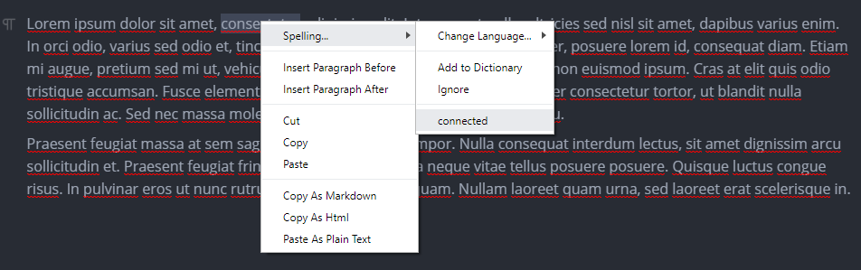
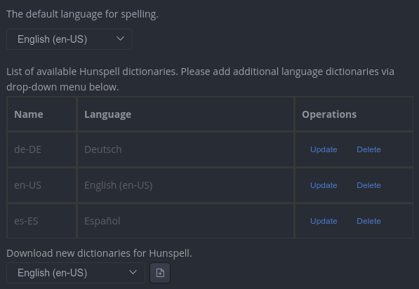

# 拼写检查（Spelling）

MarkText 支持在输入时自动检查拼写错误，并提供替换建议

在当前仓库实现中，拼写检查基于 Electron/Chromium 的内置拼写检查能力：

- **macOS**：使用系统拼写检查器，语言会在输入时自动检测（右键菜单不会显示“切换语言”入口）
- **Windows / Linux**：使用 Chromium 的拼写检查语言包；可在设置里选择默认语言，也可在运行时通过右键菜单打开语言切换

启用方式：在设置（Preferences）里进入 **Spelling**，打开“Enable spell checking（启用拼写检查）”

## 1. 功能

**自动语言检测（macOS）：**

在 macOS 上，语言由系统拼写检查器在输入时自动检测

**不显示拼写错误下划线：**

如果你不希望拼写错误以红色波浪线标出，可以在设置中开启“Hide marks for spelling errors（隐藏拼写错误标记）”
这不会关闭拼写检查本身，只是隐藏标记；同时也可能让编辑体验更流畅一些

**添加自定义词典词条：**

对一个被标记为拼写错误的单词点击右键：

- 选择 `Add to Dictionary` 可以把该单词加入自定义词典
- 选择 `Ignore` 可以临时忽略该单词

（Windows/Linux 还支持在设置页查看并删除自定义词典中的词条）

## 2. 管理词典与语言

### 2.1 macOS（系统拼写检查器）

在 macOS 上，拼写检查语言由系统管理。你可以在系统设置的 **Language & Region（语言与地区）** 中添加/启用更多语言

### 2.2 Windows / Linux（Chromium 拼写语言）

在 Windows/Linux 上，MarkText 会使用 Chromium 可用的拼写检查语言

- **设置默认语言**：在设置（Preferences）→ **Spelling** 中选择 “Default language for spell checking”
- **运行时切换语言**：右键菜单 `Spelling -> Change Language...` 会打开语言选择（实际会唤起命令面板的语言选择流程）
- **查看/维护自定义词典（Windows/Linux）**：在设置（Preferences）→ **Spelling** 中可以看到 “Custom dictionary” 列表，并可删除不需要的词条

